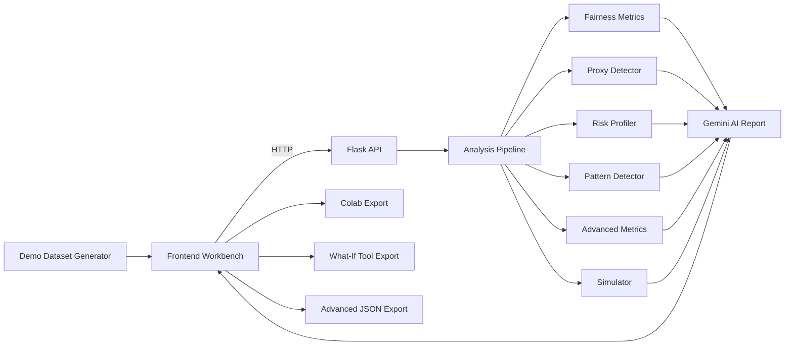

<p align="center">
  
</p>

<p align="center">
  
  
  
</p>

<h1 align="center">bAIsed</h1>

<p align="center">
  A full-stack AI fairness workbench for dataset bias auditing, disparity diagnostics, scenario simulation, and actionable remediation guidance.
</p>

---

## Overview

**bAIsed** helps teams evaluate, explain, and reduce bias in datasets and machine-learning decision workflows. It combines deterministic fairness metrics, dataset diagnostics, proxy detection, risk profiling, simulation, export tooling, and Gemini-assisted reporting in a browser-based workflow.

The project is designed for researchers, students, and builders who need a practical fairness audit surface without stitching together multiple notebooks, scripts, and reporting tools by hand.

---

## Core Capabilities

- Run quick fairness checks from simple group selection-rate inputs.
- Upload `.csv` or `.xlsx` datasets for structured fairness analysis.
- Upload trained `.pkl`, `.joblib`, or TensorFlow/Keras models with test data for direct prediction fairness analysis.
- Auto-detect likely protected attributes, outcome columns, and qualification signals.
- Compute fairness metrics including DIR, SPD, EOD, AOD, and an aggregate bias score.
- Identify bias hotspots, intersectional disparities, and high-impact feature patterns.
- Detect proxy features using association and correlation signals.
- Profile dataset reliability based on missingness, imbalance, subgroup size, and outcome quality.
- Classify likely bias patterns such as proxy bias, threshold-driven disparity, and underrepresentation.
- Simulate what-if remediation scenarios and estimate trade-offs.
- Generate Gemini-powered audit reports with findings and recommendations.
- Export analysis assets for Google Colab, TensorBoard What-If Tool, and advanced JSON workflows.

---

## Why bAIsed

bAIsed complements fairness libraries such as Fairlearn by focusing on an end-to-end audit experience:

- **Interactive workbench:** Upload data, inspect metrics, review hotspots, run simulations, and generate reports from one UI.
- **Dataset-first diagnostics:** Risk profiling, proxy detection, and column detection help users understand whether an audit result is reliable.
- **AI-assisted reporting:** Gemini integration translates metric outputs into readable audit findings and remediation guidance.
- **Exportable workflows:** Colab notebooks, What-If Tool bundles, and JSON exports make it easier to continue analysis outside the app.
- **Modular Flask backend:** Analysis, simulation, risk profiling, proxy detection, pattern classification, and export logic are separated for easier extension.

---

## Architecture



---

## Feature Modules

### Fairness Analysis

The main analysis pipeline computes group-level outcomes, selection-rate disparities, warning signals, feature influence, repair suggestions, and structured metric explanations.

Implemented metrics include:

- **DIR - Disparate Impact Ratio:** lowest group selection rate divided by highest group selection rate.
- **SPD - Statistical Parity Difference:** difference between the highest and lowest group rates.
- **EOD - Equal Opportunity Difference:** disparity within a qualified subset when qualification data is available.
- **AOD - Average Odds Difference:** combined disparity signal.
- **Bias Score:** normalized 0-100 severity score derived from the metric set.

### Model Fairness Analysis

The workbench also supports a trained-model audit path:

1. Upload a CSV/XLSX test dataset.
2. Choose a protected attribute and true label column.
3. Upload a `.pkl`, `.joblib`, `.keras`, `.h5`, or `.hdf5` model.
4. bAIsed runs model predictions, stores them in `model_prediction`, and audits those predictions across protected groups.

When true labels are available, the response includes group-level accuracy, error rate, true-positive-rate, false-positive-rate, and false-negative-rate gaps. Model upload support requires compatible server dependencies for the model artifact, such as scikit-learn/joblib or TensorFlow.

### Advanced Fairness Analysis

`backend/fairness_advanced.py` adds:

- Bootstrap confidence intervals.
- Mitigation suggestions.
- Intersectional analysis across multiple protected attributes.
- Additional advanced metric packaging for export.

### Proxy Bias Detection

`backend/proxy_detector.py` identifies features that may act as proxies for protected attributes:

- Cramer's V for categorical associations.
- Correlation for numeric relationships.
- Eta-squared for numeric-to-categorical association.
- Risk levels for high, medium, and low proxy signals.

### Dataset Risk Profiling

`backend/risk_profiler.py` scores audit reliability using:

- Missing value ratios.
- Small subgroup sizes.
- Group imbalance.
- Outcome imbalance.
- Proxy-risk indicators.

### Bias Pattern Detection

`backend/pattern_detector.py` classifies common bias patterns:

- `PROXY_BIAS`
- `INTERSECTIONAL_HIDDEN_BIAS`
- `THRESHOLD_DRIVEN_DISPARITY`
- `SMALL_SAMPLE_UNRELIABLE`
- `GROUP_UNDERREPRESENTATION`
- `GLOBAL_SELECTION_DISPARITY`
- `NO_SIGNIFICANT_BIAS`

### Export Tools

`backend/exporters.py` supports:

- Google Colab notebook export.
- TensorBoard What-If Tool bundle export.
- Advanced JSON export for downstream analysis.

---

## Tech Stack

<p align="center">
  
  
  
  
  
  
  
  
</p>

---

## Project Structure

```text
bAIsed/
|-- backend/
|   |-- __init__.py
|   |-- app.py
|   |-- api.py
|   |-- analysis.py
|   |-- auth.py
|   |-- demo_datasets.py
|   |-- exporters.py
|   |-- fairness_advanced.py
|   |-- fb_admin.py
|   |-- pattern_detector.py
|   |-- preprocessor.py
|   |-- proxy_detector.py
|   |-- requirements.txt
|   |-- risk_profiler.py
|   |-- simulator.py
|   `-- temp_datasets/
|-- frontend/
|   |-- css/
|   |   `-- custom.css
|   |-- js/
|   |   |-- auth.js
|   |   |-- firebase-config.js
|   |   |-- site.js
|   |   `-- workbench.js
|   `-- pages/
|       |-- 404.html
|       |-- about.html
|       |-- case_study.html
|       |-- contact.html
|       |-- dashboard.html
|       |-- landing.html
|       |-- login.html
|       |-- methodology.html
|       |-- pricing.html
|       |-- privacy_policy.html
|       |-- signup.html
|       |-- solutions.html
|       |-- terms_of_service.html
|       `-- workbench.html
|-- run.py
|-- test_data.csv
`-- README.md
```

---

## API Overview

### Site and Utility Endpoints

- `GET /api/health`
- `GET /api/site-content/<page_name>`
- `GET /api/search?query=...`
- `POST /api/actions/resolve`
- `POST /api/demo-request`
- `GET /api/downloads/whitepaper`

### Workbench Endpoints

- `POST /analyze` - quick fairness check from group percentages.
- `POST /scan` - inspect uploaded data and detect likely columns.
- `POST /upload` - upload a dataset and run the full analysis pipeline.
- `POST /model-upload` - upload a trained model plus test data and run a direct prediction fairness audit.
- `POST /simulate` - run what-if fairness improvement scenarios.
- `POST /ai-analyze` - generate a Gemini-assisted audit report.
- `GET /api/demo-dataset/<type>` - download demo data for `credit`, `resume`, or `policing`.
- `GET /api/export/colab/<dataset_id>` - export a Google Colab notebook.
- `GET /api/export/what-if/<dataset_id>` - export a TensorBoard What-If Tool bundle.
- `GET /api/export/advanced-json/<dataset_id>` - export advanced analysis JSON.
- `POST /reset` - clear temporary uploaded datasets.

### Authentication Endpoints

- `POST /api/auth/verify`
- `GET /api/auth/profile`
- `POST /api/auth/profile`

> Firebase profile operations are scaffolded and should be completed before production enforcement.

---

## Local Setup

### Prerequisites

- Python 3.11 or newer
- `pip`

### Install Dependencies

```bash
pip install -r backend/requirements.txt
```

### Configure Environment Variables

Create `backend/.env` or export the variables in your shell:

```env
GEMINI_API_KEY=your_google_ai_key
GEMINI_MODEL=gemini-1.5-flash

FLASK_ENV=development
FLASK_SECRET_KEY=change-me

GOOGLE_APPLICATION_CREDENTIALS=serviceAccountKey.json
```

### Run the Application

```bash
python run.py
```

Open:

- `http://127.0.0.1:5000/`
- `http://127.0.0.1:5000/workbench`

---

## Quick Start

### Try a Demo Dataset

1. Start the Flask app with `python run.py`.
2. Open `http://127.0.0.1:5000/workbench`.
3. Load a demo dataset for lending, hiring, or policing.
4. Review the metrics, proxy risks, reliability score, and recommended actions.
5. Export the result to Colab, What-If Tool, or JSON if needed.

### Audit Your Own Dataset

1. Open the Dataset Audit workflow in the workbench.
2. Upload a `.csv` or `.xlsx` file.
3. Select protected attribute and outcome columns, or use auto-detection.
4. Review fairness metrics, hotspots, feature impact, and risk profiling.
5. Run simulations to compare remediation options.
6. Generate an AI-assisted report and export the analysis.

### Audit A Trained Model

1. Open the Model Audit workflow in the workbench.
2. Upload test data with protected attributes, model features, and a true label.
3. Upload a `.pkl`, `.joblib`, `.keras`, `.h5`, or `.hdf5` model.
4. Select the protected attribute and true label columns.
5. Run the audit to evaluate the model's generated predictions and group-level error disparities.

---

## Deployment

This project can run anywhere that supports a Python Flask application. A typical production start command is:

```bash
gunicorn backend.app:app
```

For Render, use:

```bash
pip install -r backend/requirements.txt
```

as the build command, and:

```bash
gunicorn backend.app:app
```

as the start command.

Before deploying, configure the required environment variables, keep credentials out of source control, and ensure Firebase and Gemini credentials are available only on the server.

---

## Important Notes

- Temporary uploaded datasets are stored in `backend/temp_datasets/`.
- The `/reset` endpoint clears temporary uploaded datasets.
- Column names are standardized during preprocessing.
- Gemini reporting requires `GEMINI_API_KEY`.
- Firebase admin credentials must remain server-side.
- Authentication is scaffolded and should be hardened before production use.
- Do not commit `.env`, service account files, or generated temporary datasets.

---

## Troubleshooting

- **Gemini report errors:** Confirm `GEMINI_API_KEY` is configured and the Generative Language API is enabled.
- **Upload parsing errors:** Validate that the file is a readable `.csv` or `.xlsx`.
- **Unexpected fairness output:** Check that the selected outcome is binary or can be converted into a binary decision signal.
- **Weak audit confidence:** Review subgroup size, missing data, and outcome imbalance warnings.
- **Render import errors:** Use `gunicorn backend.app:app` as the start command and confirm dependencies are installed.

---

## Roadmap

- Complete production-ready Firebase profile enforcement.
- Add formal automated tests for the full API and analysis pipeline.
- Expand mitigation recommendations with configurable policy constraints.
- Split long-form technical documentation into dedicated `docs/` files.

---
