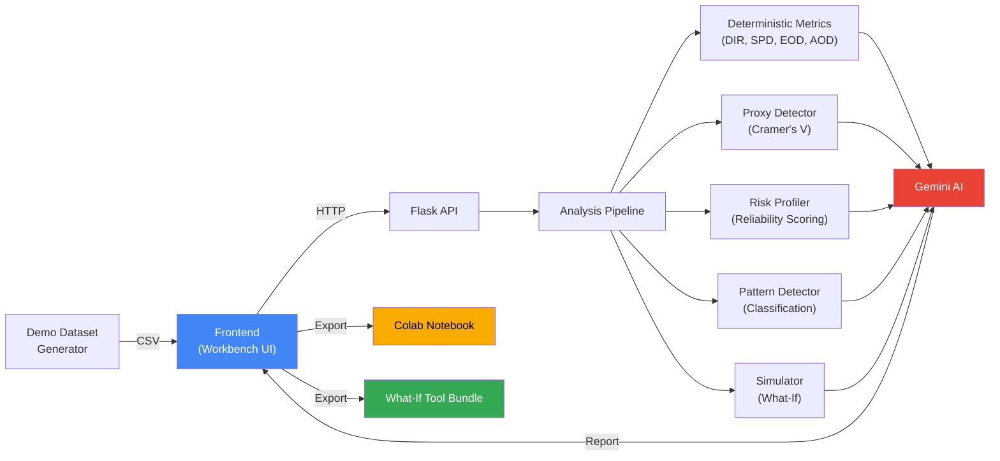

# bAIsed


<p align="center">
  
  
  
</p>

<p align="center">
  AI fairness workbench for dataset bias auditing, disparity diagnostics, simulation, and actionable remediation guidance.
</p>

---

## Overview

**bAIsed** is a full‑stack AI fairness auditing platform that helps teams detect, explain, and reduce bias in machine‑learning models and datasets.

It combines deterministic fairness metrics, a browser‑based analysis interface, what‑if simulation, and Gemini‑powered reporting in one workflow so users can move from detection to remediation quickly.

---

## What This Project Does

bAIsed helps users to:

- Run fairness checks using simple percentage inputs or real datasets (`.csv`, `.xlsx`).
- Compute core parity metrics such as **DIR**, **SPD**, **EOD**, and **AOD**.
- Detect root‑cause feature impact and subgroup hotspots.
- Detect proxy features that act as protected‑attribute proxies (Cramer's V, correlation).
- Profile dataset risk for missing values, group imbalance, and outcome reliability.
- Classify bias patterns (proxy bias, intersectional, threshold‑driven, etc.).
- Generate what‑if simulations to estimate fairness improvements.
- Generate AI‑written analysis reports using **Google Gemini**.
- Export to Google Colab for exploratory analysis.
- Export to What‑If Tool format for TensorBoard integration.
- Produce actionable remediation suggestions.

---

## Architecture



---

## New Phase 2‑3 Modules

### Proxy Bias Detector (`proxy_detector.py`)
- Detects whether features act as proxies for protected attributes.
- **Cramer's V** for categorical‑vs‑categorical associations.
- **Correlation** for numeric features.
- **Eta‑squared** for numeric‑vs‑categorical.
- Output: Association scores and risk levels (HIGH/MEDIUM/LOW).

### Dataset Risk Profiler (`risk_profiler.py`)
- Scores dataset reliability for audit interpretation.
- Missing value ratios, small subgroup sizes, group imbalance, outcome imbalance, proxy feature risk factors.
- Output: Risk score (0–100) and confidence level.

### Bias Pattern Detector (`pattern_detector.py`)
- Classifies the type of bias detected:
  - `PROXY_BIAS`
  - `INTERSECTIONAL_HIDDEN_BIAS`
  - `THRESHOLD_DRIVEN_DISPARITY`
  - `SMALL_SAMPLE_UNRELIABLE`
  - `GROUP_UNDERREPRESENTATION`
  - `GLOBAL_SELECTION_DISPARITY`
  - `NO_SIGNIFICANT_BIAS`

### Export Modules (`exporters.py`)
- **Colab Export**: Generates Jupyter notebooks with dataset, metrics, and fairness analysis.
- **What‑If Tool Export**: Creates ZIP bundles compatible with Google TensorBoard What‑If Tool.

---

## Tech Stack

<p align="center">
  
  
  
  
  
  
  
  
  
  
  
</p>

---

## Key Features

### Fairness Evaluation
- Instant fairness checks using manual group inputs.
- Dataset‑based bias analysis for uploaded `.csv` and `.xlsx` files.
- Structured metric output for clear interpretation.

### Deep Dataset Diagnostics
- Group statistics and disparity detection.
- Feature impact ranking.
- Bias hotspot identification.
- Suggested remediation paths.

### AI‑Assisted Reporting
- Gemini‑powered report synthesis.
- Plain‑language summaries of metrics and findings.
- Faster analysis for technical and non‑technical users.

### Simulation and Exploration
- What‑if simulation for fairness improvement.
- Estimated changes in parity and accuracy.
- Interactive trade‑off analysis.

### Demo Datasets
- Built‑in bias examples for quick testing:
  - **Credit/Lending**: Age‑based discrimination via income and ZIP code proxy.
  - **Hiring/Resume**: Gender bias with tech club membership as proxy.
  - **Policing**: Race‑based bias with neighborhood as proxy.

### Export and Integration
- **Google Colab**: Export standardized datasets with fairness analysis cells.
- **What‑If Tool**: Export for TensorBoard What‑If Tool workflows.
- **Gemini Integration**: AI‑powered audit reports with evidence and recommendations.

---

## Metrics Implemented

bAIsed computes the following fairness signals:

- **DIR (Disparate Impact Ratio)**: minimum selection rate divided by maximum selection rate.
- **SPD (Statistical Parity Difference)**: difference between the highest and lowest group rates.
- **EOD (Equal Opportunity Difference)**: disparity inside the qualified subset.
- **AOD (Average Odds Difference)**: combined disparity signal.
- **Bias Score (0–100)**: weighted aggregate of DIR gap, SPD, EOD, and AOD.

### Severity Thresholds

- **HIGH**: DIR < 0.5
- **MODERATE**: 0.5 ≤ DIR < 0.8
- **LOW**: DIR ≥ 0.8

---

## System Flow

1. The user opens the **Workbench**.
2. The frontend sends requests for either quick analysis or dataset analysis.
3. The backend processes the data and computes fairness metrics.
4. Results are returned as structured JSON.
5. The UI renders metrics, hotspots, feature analysis, and repair suggestions.
6. The simulator estimates how fairness and accuracy change under alternative settings.
7. The AI analyzer generates a readable fairness report with Gemini.
8. The user can export the report as PDF or revisit the run later from their audit history.

---

## Wireframes / Mock UI

The solution is designed as a multi‑panel fairness workbench with screens for:

- Landing/dashboard overview
- Dataset upload and schema detection
- Fairness metrics dashboard
- Bias hotspot and intersectional analysis
- Fairness simulator
- AI‑generated report and recommendations
- PDF export and user history

---

## Project Structure

```text
bAIsed/
├─ backend/
│  ├─ __init__.py
│  ├─ app.py
│  ├─ api.py
│  ├─ analysis.py
│  ├─ simulator.py
│  ├─ preprocessor.py
│  ├─ auth.py
│  ├─ fb_admin.py
│  ├─ proxy_detector.py      (NEW)
│  ├─ risk_profiler.py       (NEW)
│  ├─ pattern_detector.py    (NEW)
│  ├─ demo_datasets.py       (NEW)
│  ├─ exporters.py           (NEW)
│  ├─ requirements.txt
│  ├─ .env
│  └─ temp_datasets/
├─ frontend/
│  ├─ pages/
│  │  ├─ workbench.html
│  │  ├─ landing.html
│  │  ├─ about.html
│  │  ├─ solutions.html
│  │  ├─ methodology.html
│  │  ├─ case_study.html
│  │  ├─ pricing.html
│  │  ├─ login.html
│  │  ├─ signup.html
│  │  ├─ dashboard.html
│  │  └─ 404.html
│  ├─ js/
│  │  ├─ workbench.js
│  │  ├─ site.js
│  │  ├─ auth.js
│  │  └─ firebase-config.js
│  └─ css/
│     └─ custom.css
├─ run.py
├─ test_comprehensive.py     (NEW - Test suite)
├─ app.yaml
├─ .env.example
├─ test_data.csv
├─ README.md
└─ .gitignore
```

---

## API Overview

### Site and Utility Endpoints
- `GET /api/health`
- `GET /api/site-content/<page_name>`
- `GET /api/search?query=...`
- `POST /api/actions/resolve`
- `POST /api/demo-request`
- `GET /api/downloads/whitepaper`

### Workbench Endpoints
- `POST /analyze` – Quick fairness check with group percentages.
- `POST /scan` – Analyze dataset structure and detect columns.
- `POST /upload` – Upload CSV/XLSX and run complete analysis.
- `POST /simulate` – What‑if fairness improvement scenarios.
- `POST /ai-analyze` – Generate Gemini‑powered audit report.
- `GET /api/demo-dataset/<type>` – Download demo dataset (credit, resume, policing).
- `GET /api/export/colab/<dataset_id>` – Export Colab notebook.
- `GET /api/export/what-if/<dataset_id>` – Export What‑If Tool bundle.
- `POST /reset` – Clear temporary datasets.

### Authentication Endpoints
- `POST /api/auth/verify`
- `GET /api/auth/profile`
- `POST /api/auth/profile`

> **Note:** Firebase admin profile operations are scaffolded and not fully implemented yet.

---

## Local Setup

### Prerequisites
- Python 3.11 or higher
- pip

### Install Dependencies
```bash
pip install -r backend/requirements.txt
```

### Configure Environment Variables
Create `backend/.env` or export the variables in your environment:
```env
GEMINI_API_KEY=your_google_ai_key
GEMINI_MODEL=gemini-1.5-flash

FLASK_ENV=development
FLASK_SECRET_KEY=change-me

GOOGLE_APPLICATION_CREDENTIALS=serviceAccountKey.json
```
Reference `.env.example` for additional placeholders.

### Run the Application
```bash
python run.py
```

Open:
- `http://127.0.0.1:5000/`
- `http://127.0.0.1:5000/workbench`

---

## Deployment

This repository includes Google App Engine configuration in `app.yaml`:
```yaml
runtime: python311
entrypoint: gunicorn -b :$PORT backend.app:app
```

### Render Deployment
If you deploy on Render, use:

**Build Command**
```bash
pip install -r backend/requirements.txt
```
**Start Command**
```bash
gunicorn backend.app:app
```

### Deploy Steps
1. Create or select a Google Cloud project.
2. Enable App Engine and the Generative Language API.
3. Set the required environment variables, especially `GEMINI_API_KEY`.
4. Deploy the application:
```bash
gcloud app deploy
```
5. Open the deployed service:
```bash
gcloud app browse
```

---

## Built with Google AI & Tools

bAIsed integrates Google's AI and fairness tools:

### Google Gemini
- Powers AI‑assisted audit report generation.
- Structured JSON responses with evidence and recommendations.
- Confidence‑rated findings and compliance notes.
- Set `GEMINI_API_KEY` environment variable to enable.

### Google Colab Integration
- Export analyzed datasets as Jupyter notebooks.
- Run fairness metrics and charts in Colab.
- Collaborate and share analysis.

### Google What‑If Tool
- Export datasets compatible with TensorBoard What‑If Tool.
- Explore counterfactual scenarios.
- Visualize fairness metrics by group.

---

## Quick Start Demo

### Load a Demo Dataset
1. Open `http://localhost:5000/workbench`
2. Click one of the demo buttons (💳 Lending, 👔 Hiring, 🚔 Policing)
3. Review the fairness metrics dashboard
4. Check the AI‑generated report
5. Export to Colab or What‑If Tool

### Upload Your Own Data
1. Open the Dataset Audit tab
2. Upload a CSV or XLSX file
3. (Optional) Select protected attribute and outcome columns, or let auto‑detect work
4. Review proxy risk, dataset reliability, and bias patterns
5. Run what‑if simulations
6. Generate Gemini report
7. Export for further analysis

---

## Important Notes

- Uploaded standardized files are stored temporarily in `backend/temp_datasets/`.
- The `/reset` endpoint clears temporary uploads.
- Do not hardcode API keys or secrets in source files.
- Keep Firebase admin credentials server‑side only.
- The auth backend is scaffolded and should be completed before production enforcement.
- Column names are standardized to snake_case during preprocessing.

---

## Troubleshooting

- **Gemini errors**: Verify `GEMINI_API_KEY` and API enablement in Google Cloud.
- **Upload parsing issues**: Make sure the file is a valid `.csv` or `.xlsx`.
- **Unexpected fairness output**: Use at least two valid groups and a binary or derivable outcome signal.
- **Auth failures**: Check Firebase configuration and credential wiring.
- **Render import errors**: Confirm `backend/__init__.py` exists and the start command points to `backend.app:app`.

---

## Suggested Documentation Split

For cleaner maintenance, this README can be split into:

- `README.md` for overview and quickstart
- `docs/ARCHITECTURE.md` for system internals
- `docs/API.md` for request and response schemas

---

## License

Add your preferred license here before publishing the repository.
